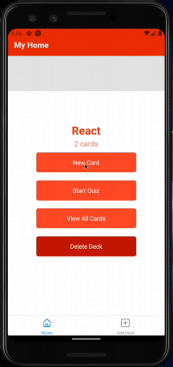
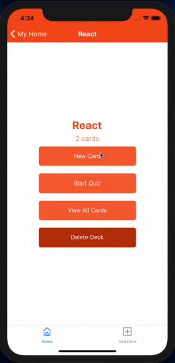

# Flash Cards Project

A React Native application that allows users to study collections of flashcards. The app allows users to create different categories of decks, add flashcards to those decks, and take quizzes on the decks.

  
  

## Instructions

1. Clone the repo or download all the files
2. Navigate to the project folder and install all the dependencies with `yarn install`
3. Run the app with `expo start`

## Platform

This app was developed and tested using [expo](https://expo.io/) running on Google Pixel 4 (Android 10) and iPhone X (iOS 14 Public Beta 2)

## Authors

* Ivan Cheng 
